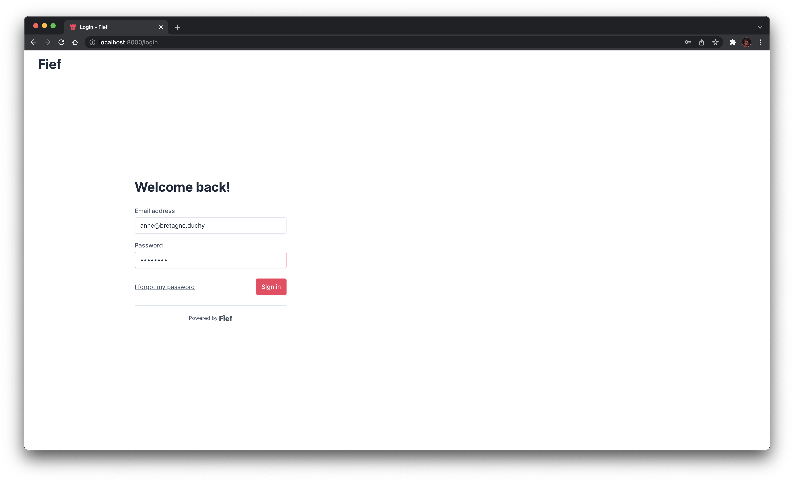
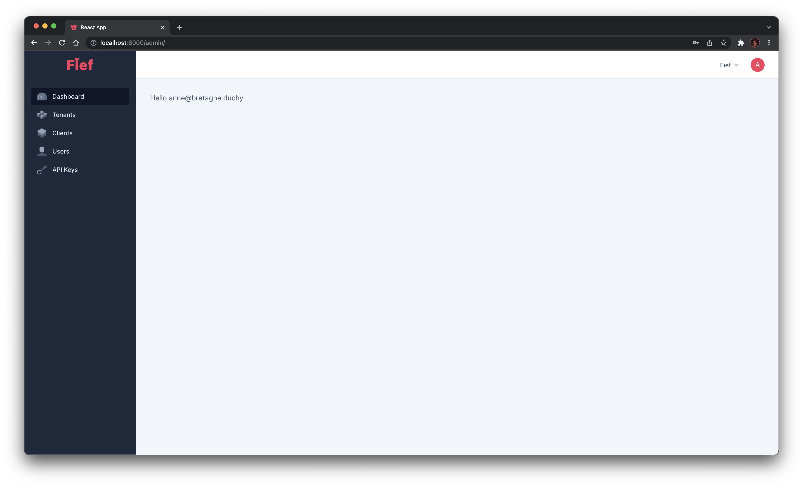

# Quickstart

We provide a [Docker](https://www.docker.com/get-started) image to help you start the Fief server locally in no time!

Run the following command:

```bash
docker run --rm ghcr.io/fief-dev/fief:latest fief quickstart --docker
```

The result of this command is a complete **`docker run` command** with the required **secrets** generated to help you get started. It'll look like the following:

```bash
docker run \
  --name fief-server \
  -p 8000:80
  -d \
  -e "SECRET=XXX" \
  -e "FIEF_CLIENT_ID=XXX" \
  -e "FIEF_CLIENT_SECRET=XXX" \
  -e "ENCRYPTION_KEY=XXX" \
  ghcr.io/fief-dev/fief:latest
```

!!! warning "Save those secrets somewhere safe!"
    If you need restart or recreate your container, you'll probably need to set the same secrets again. If you lose them, you'll likely lose access to data or have a bad configuration. [Read more about secrets and environment variables.](environment-variables.md)

!!! info
    The container is exposed on the port **8000** of your local machine by default, but you can set any port you want.&#x20;

## Create main workspace

Next, you'll need to create the main **workspace**. Simply run the following command:

```bash
docker exec fief-server fief create-main-workspace
```

You should see the following output:

```
Main Fief workspace created
```

## Create admin user

Finally, you need to create an **admin user** for this main workspace that'll have access to the admin dashboard. Run the following command:

```bash
docker exec -it fief-server fief create-main-user --user-email anne@bretagne.duchy
```

!!! info
    Of course, make sure to replace `--user-email` value with your own email address!

You'll then be prompted for a password. If everything goes well, you should see the following output:

```
Main Fief user created
```

## Good to go!

At this point, your Fief server should be up-and-running! Open [http://localhost:8000/admin/](http://localhost:8000/admin/) to access the admin dashboard. You'll be redirected to a login page. Authenticate with the user credentials you created in the previous section.



You'll then be redirected to the admin dashboard.



Congratulations! Your Fief server instance is up-and-running 🎉 You can now try Fief features and start to integrate authentication in your app.

!!! info
    For production deployment, we strongly recommend you to read the next sections.

## Limitations

While quick and convenient, this way of running Fief is **not suitable for production environments**. Under the hood, it stores the data in the form of **SQLite databases**. If you ever happen to destroy your container, you'll lose all your data.

The best way is of course to configure a proper PostgreSQL or MySQL database for your Fief server, as described in the dedicated section.

[Setup database](setup-database.md){ .md-button }

### Use a Docker volume to persist SQLite data

If you really want to use SQLite, or mitigate the risk of losing data in your local environment, you can attach your container to a [Docker volume](https://docs.docker.com/storage/volumes/). This way, even if the container is destroyed, you can create a new one and attach again the data.

The first thing to do is to create a Docker volume:

```
docker volume create fief-server-data
```

Then, create your Fief server container and attach this volume to the `/data` folder on the container:

```bash
docker run \
  --name fief-server \
  -p 8000:80
  -d \
  -v fief-server-volume:/data \
  -e "SECRET=XXX" \
  -e "FIEF_CLIENT_ID=XXX" \
  -e "FIEF_CLIENT_SECRET=XXX" \
  -e "ENCRYPTION_KEY=XXX" \
  ghcr.io/fief-dev/fief:latest
```

!!! info
    If you created your container with the instructions in the previous section, you'll need to recreate one from scratch to bind the volume.
